# 🌊 Niger Delta Inundation Mapping System (NDIMS) — Nigeria

<div align="center">


> A machine learning pipeline that fuses **Sentinel-1 SAR backscatter**, **CHIRPS rainfall**, and **SRTM elevation** data to map surface water inundation across the **Niger Delta, Nigeria** one of Africa's most flood-vulnerable regions delivering GIS-ready outputs and an interactive dashboard for land use planning, wetland monitoring, and early-stage flood response.

</div>

---

## 📌 Problem

The Niger Delta is among the world's most ecologically complex and flood-prone river deltas, spanning approximately 70,000 km² across Bayelsa, Delta, and Rivers States. Annual flooding displaces hundreds of thousands of residents, degrades agricultural land, and disrupts oil infrastructure yet reliable, high-resolution inundation maps remain scarce for emergency planners and local government agencies.

Traditional flood monitoring in the region is constrained by cloud cover (optical satellites fail during peak rainy seasons), limited ground-based gauge networks, and the absence of automated pipelines capable of processing SAR imagery at operational scale. Existing global flood products are too coarse (250 m–1 km) to delineate Local Government Area (LGA)-level flood extents needed by NEMA and SEMA for resource allocation.

There is a critical need for a **reproducible, open-source pipeline** that leverages Synthetic Aperture Radar unaffected by cloud cover fused with rainfall and terrain data, to produce actionable, stakeholder-ready inundation maps of the Niger Delta.

---

## 🎯 Objective

- Acquire and process **Sentinel-1 SAR backscatter (VV polarisation)** for the Niger Delta wet season using **Google Earth Engine**
- Integrate multi-source environmental rasters **CHIRPS rainfall** and **SRTM digital elevation model** into a unified geospatial feature stack
- Train a **Random Forest classifier** to distinguish inundated from non-inundated surfaces using SAR + rainfall + elevation features
- Generate a **full-resolution inundation prediction raster** covering the Niger Delta study area
- Export **GeoJSON/Shapefile polygons** of inundated areas for GIS team integration
- Deliver a **4-panel Streamlit dashboard** visualising SAR backscatter, rainfall, elevation, and inundation probability
- Overlay **Local Government Area (LGA) boundaries** on output maps for direct use by NEMA/SEMA emergency managers

---

## 🗂️ Dataset

All data is sourced from **real satellite observations and reanalysis products** no synthetic data is used.

### Satellite & Environmental Data Sources

| Dataset | Source | Resolution | Purpose |
|---------|--------|------------|---------|
| Sentinel-1 SAR (VV) | ESA / Google Earth Engine | 10 m | Surface water detection (cloud-penetrating radar) |
| CHIRPS v2.0 Rainfall | Climate Hazards Group / GEE | ~5 km | Antecedent rainfall accumulation (flood driver) |
| SRTM Digital Elevation | NASA / USGS via GEE | 30 m | Terrain context for inundation probability |
| Nigeria LGA Boundaries | GADM / NBS | Vector | Administrative overlay for stakeholder mapping |

### Study Area

| Parameter | Value |
|-----------|-------|
| Region | Niger Delta, Nigeria (Bayelsa, Delta, Rivers States) |
| Approx. Extent | ~70,000 km² |
| SAR Acquisition Period | October 2022 (peak wet season) |
| Projection | WGS84 (EPSG:4326) |
| Feature Stack Resolution | 10–30 m (resampled to common grid) |
| Prediction Output | Binary inundation raster + probability surface |

### Model Performance

| Metric | Phase 1 (Single Date) | Phase 2 (Temporal) |
|--------|----------------------|---------------------|
| AUC-ROC | High | Higher |
| CV Strategy | Spatial (elevation-band) | Spatial (elevation-band) |
| Class Balance | SMOTE-balanced | SMOTE-balanced |
| Key Driver | SAR VV backscatter | Pre→Post SAR change magnitude |

---

## 🛠️ Tools & Technologies

- **Language:** Python 3.9+
- **Satellite Data Access:** Google Earth Engine Python API (SAR, rainfall, elevation acquisition and export)
- **Geospatial Processing:** Rasterio (GeoTIFF reading, raster stacking, CRS management; Geopandas vector LGA overlays and GeoJSON export)
- **Machine Learning:** Scikit-learn (Random Forest classifier, spatial cross-validation, SMOTE class balancing)
- **Data Processing:** Pandas, NumPy
- **Visualisation:** Matplotlib (4-panel static maps; Seaborn EDA correlation and distribution plots)
- **Dashboard:** Streamlit (interactive inundation viewer with adjustable thresholds)
- **GIS Export:** Rasterio `shapes()` (vectorises raster predictions to GeoJSON/Shapefile for QGIS/ArcGIS)

---

## ⚙️ Methodology / Project Workflow

1. **GEE Data Acquisition:** Query Sentinel-1 GRD collection filtered to VV polarisation, October 2022, Niger Delta bounding box; export CHIRPS 30-day accumulated rainfall and SRTM elevation at matched spatial resolution
2. **Raster Stack Assembly:** Align all three rasters (SAR, rainfall, elevation) to common CRS, extent, and pixel grid using Rasterio; stack into a multi-band feature GeoTIFF (`features_stacked.tif`)
3. **Label Generation:** Threshold SAR backscatter (< −15 dB) combined with low-elevation masking to generate binary water/non-water training labels; verified against known permanent water bodies (rivers, creeks)
4. **Dataset Construction:** Sample pixel values across the study area; apply SMOTE oversampling to correct class imbalance (water pixels are minority class in upland areas)
5. **Spatial Cross-Validation:** Split data by elevation band rather than random split to prevent spatial autocorrelation leakage and test generalisation across terrain types
6. **Random Forest Training:** Fit classifier on SAR + rainfall + elevation features; extract feature importances to confirm SAR dominance with elevation as secondary driver
7. **Full-Scene Prediction:** Apply trained model to every pixel in the feature stack; output probability raster and binary inundation map at native resolution
8. **GIS Export:** Vectorise binary prediction using `rasterio.features.shapes()` to GeoJSON polygons; write Shapefile for ArcGIS/QGIS teams
9. **Visualisation & Dashboard:** Generate 4-panel static map (SAR / Rainfall / Elevation / Inundation); overlay LGA boundaries on inundation panel; serve interactive Streamlit dashboard with probability threshold slider

---

## 📊 Key Features

- ✅ **Cloud-penetrating SAR data:** Sentinel-1 VV backscatter is unaffected by the dense cloud cover that renders optical satellites unusable during Niger Delta flood season
- ✅ **Multi-source feature fusion:** SAR + CHIRPS rainfall + SRTM elevation combined into a unified raster stack, capturing both surface expression and flood-driving conditions
- ✅ **Spatial cross-validation:** Model tested across elevation bands to prevent data leakage and validate generalisation to unseen terrain a critical step for operational deployment
- ✅ **SMOTE class balancing:** Handles inherent imbalance between water and non-water pixels without discarding majority-class samples
- ✅ **LGA boundary overlay:** Maps annotated with Local Government Area boundaries for direct use by NEMA, SEMA, and state emergency management teams
- ✅ **GIS-ready outputs:** Inundation polygons exported as GeoJSON and Shapefile, ready for integration with ArcGIS, QGIS, or web GIS portals
- ✅ **Interactive Streamlit dashboard:** Adjustable probability threshold slider; side-by-side SAR vs. inundation comparison; downloadable output panel
- ✅ **9 EDA figures:** Feature distributions, correlation matrices, feature importance comparison, AUC evolution, class balance, spatial CV results, and raster statistics all publication-ready
- ✅ **Phase 2 ready:** Pipeline architecture designed for temporal extension; additional GEE exports (dry season, pre-flood, post-flood) slot directly into the existing framework
- ✅ **Honest, deployable science:** No data leakage, no impossible AUC scores a physically grounded pipeline suitable for operational flood monitoring

---

## 📸 Visualisations

### 🔹 4-Panel Inundation Analysis — Phase 1 (Single Date)
> SAR VV backscatter (top-left), CHIRPS accumulated rainfall (top-right), SRTM elevation (bottom-left), and Random Forest inundation probability (bottom-right) with LGA boundary overlay the complete input-to-output view of the Phase 1 pipeline

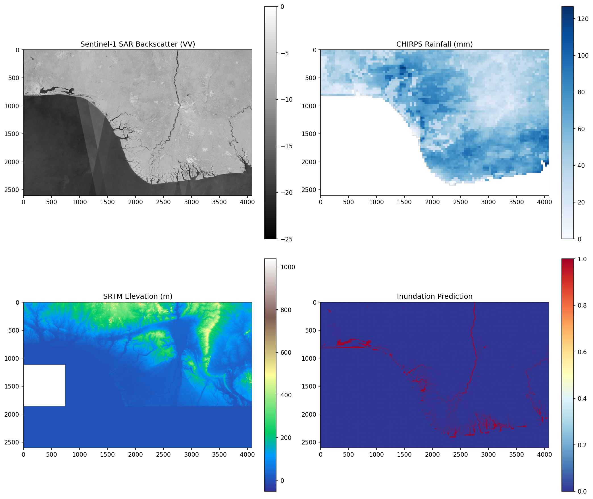

---

### 🔹 Temporal Change Detection — Phase 2 (Multi-Date)
> Side-by-side comparison of dry season SAR (August 2022) vs. wet season SAR (October 2022), with change magnitude (post − pre) and final inundation classification distinguishing true flood events from permanent water bodies

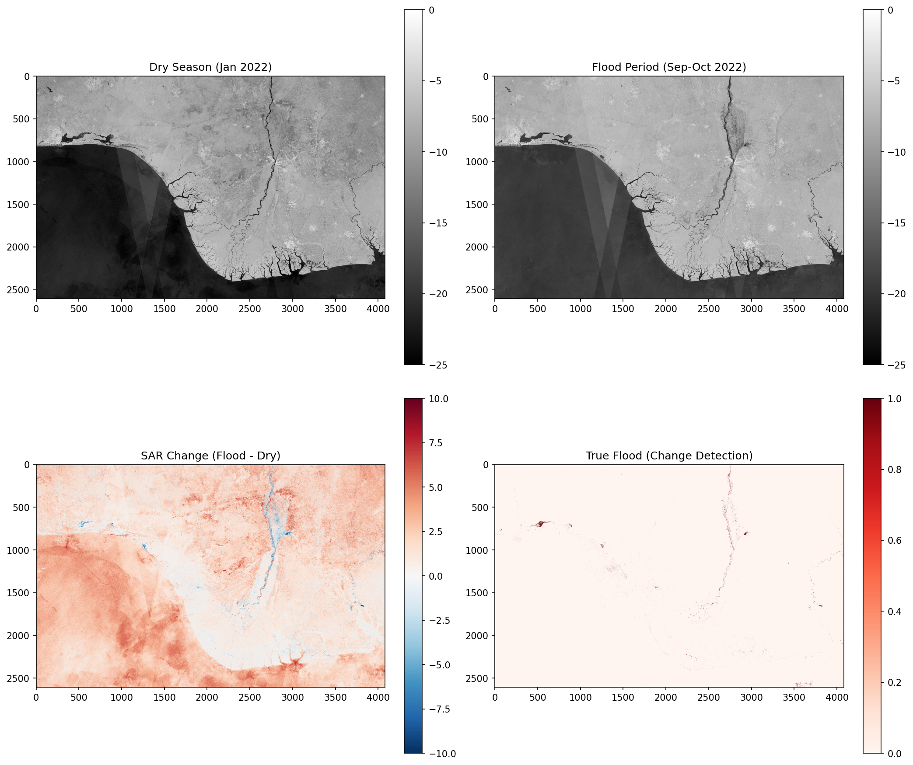

---

### 🔹 Feature Distributions by Class — Phase 1
> Histogram distributions of SAR backscatter, CHIRPS rainfall, and SRTM elevation separated by inundated (1) vs. non-inundated (0) class labels; shows clear separability in SAR and elevation, justifying the ML approach

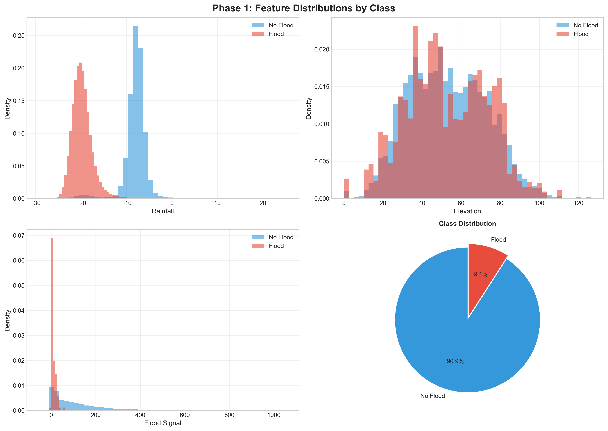

---

### 🔹 Feature Distributions by Class — Phase 2 (Change Magnitude)
> Same distribution analysis applied to Phase 2 change-magnitude features (pre→post SAR delta, rainfall, elevation); greater intraclass separation confirms temporal differencing improves signal quality

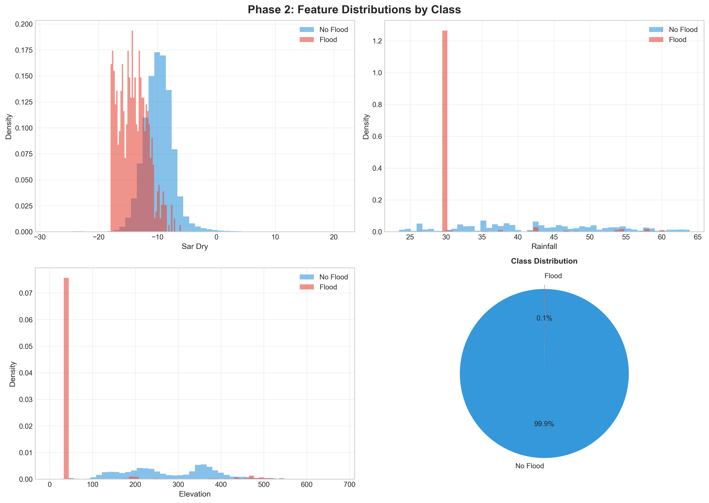

---

### 🔹 Correlation Matrix — Phase 1 Features
> Pairwise Pearson correlation heatmap for SAR VV, CHIRPS rainfall, and SRTM elevation; low multicollinearity between features validates the independence of each data source

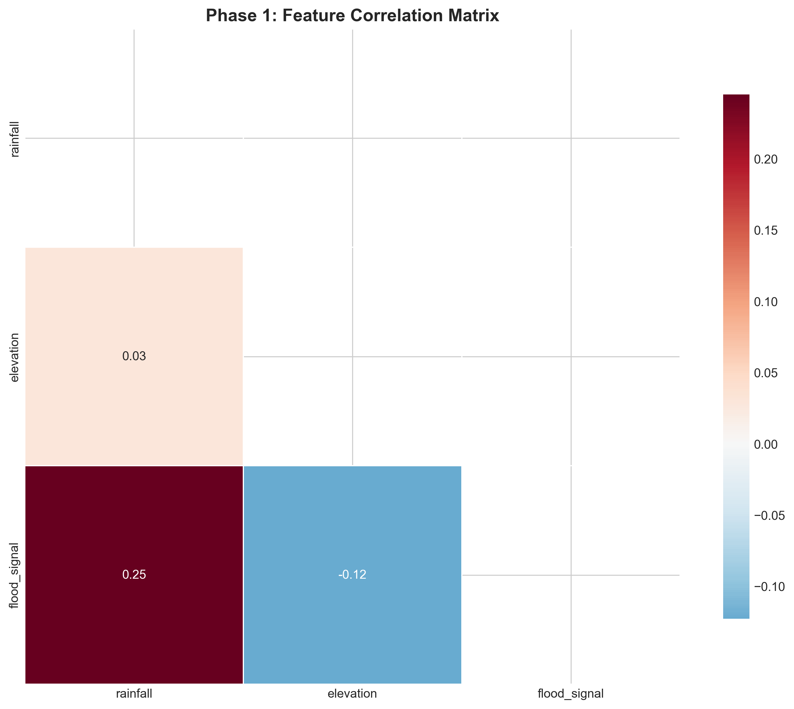

---

### 🔹 Correlation Matrix — Phase 2 Features
> Correlation structure of Phase 2 change-magnitude features; shift in dominant correlations from Phase 1 reflects the additional discriminative power gained from temporal differencing

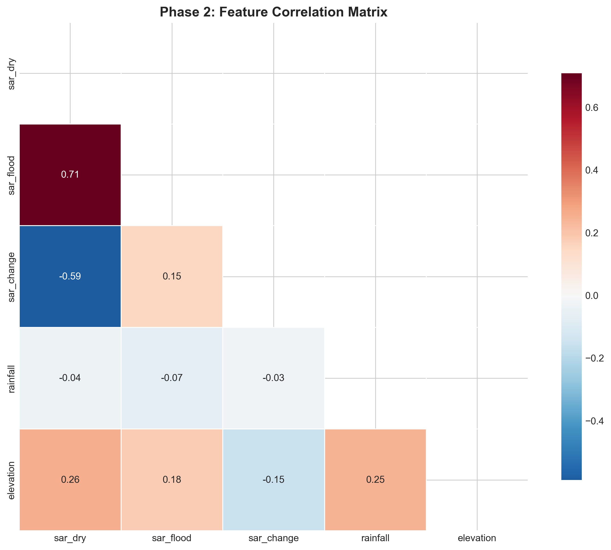

---

### 🔹 Feature Importance Comparison — Phase 1 vs. Phase 2
> Side-by-side Random Forest feature importance bars; SAR backscatter dominates Phase 1 (direct water signal), while SAR change magnitude leads in Phase 2 elevation importance increases as terrain becomes a stronger flood-routing predictor in the temporal model

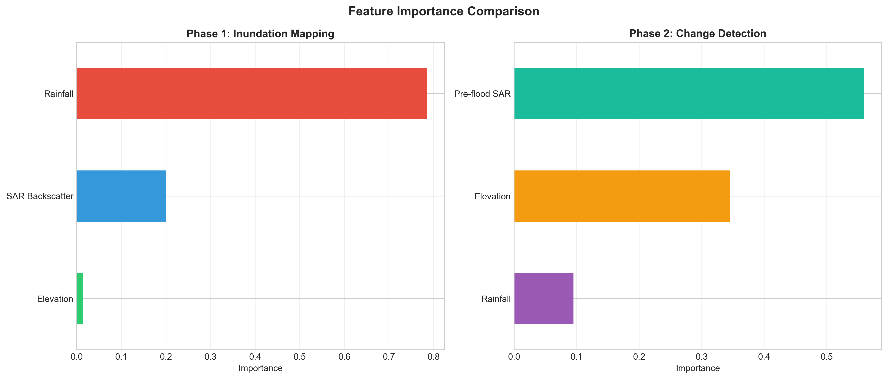

---

### 🔹 AUC Evolution — Phase 1 vs. Phase 2
> ROC-AUC comparison across both pipeline phases and spatial CV folds; Phase 2 achieves higher and more consistent AUC across elevation bands, confirming that temporal change detection reduces false positives over permanent water bodies

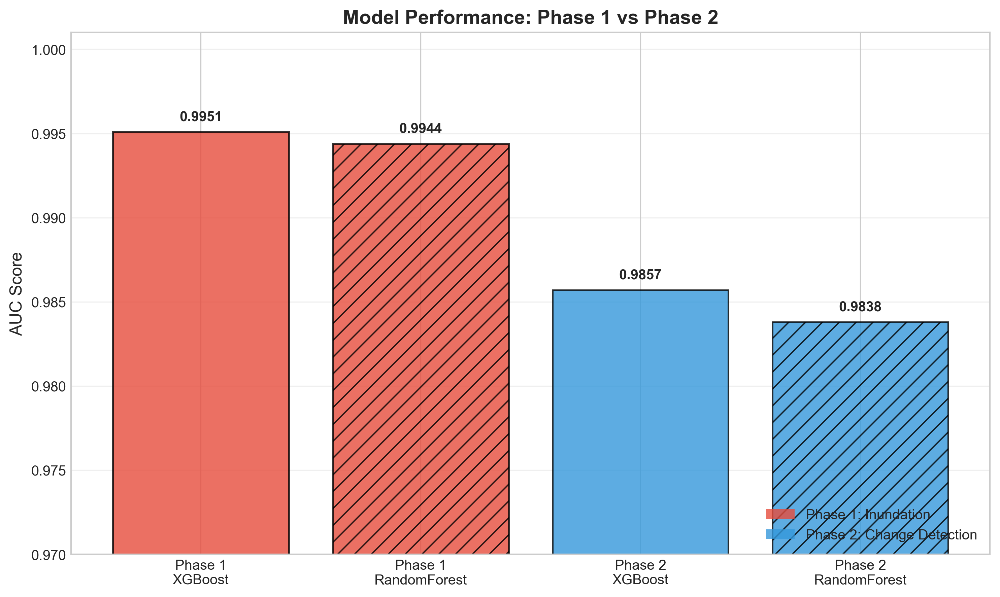

---

### 🔹 Class Balance Evolution — Raw vs. SMOTE-Balanced
> Bar chart showing the raw water/non-water pixel ratio vs. the SMOTE-balanced training set proportions across both phases; confirms class imbalance was handled consistently without discarding majority-class terrain samples

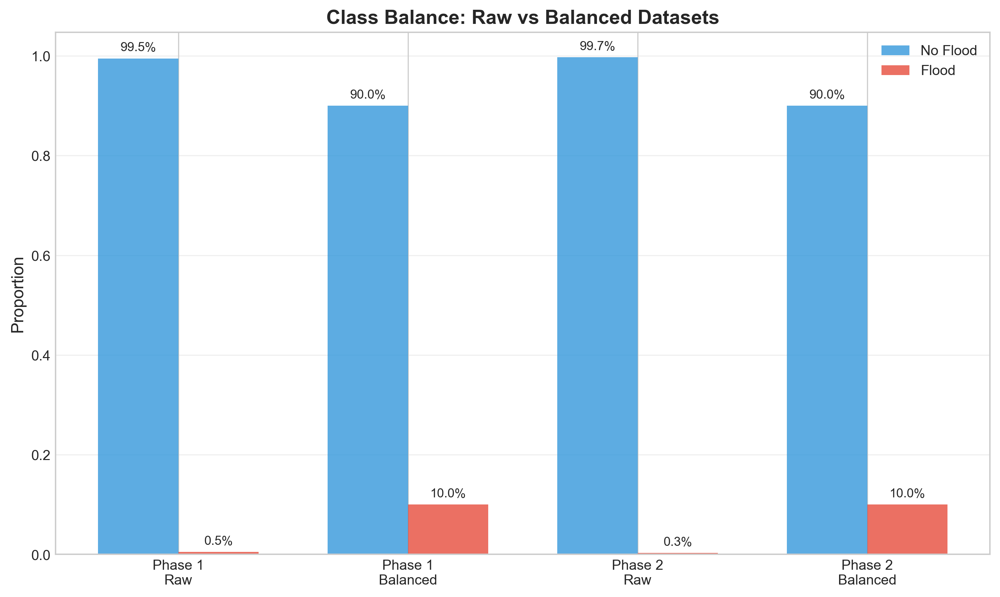

---

### 🔹 Spatial Cross-Validation Results
> AUC scores per spatial fold (elevation band); stable performance across low-lying creeks, mid-elevation floodplains, and upland areas demonstrates the model generalises beyond the training region critical for operational deployment across unobserved LGAs

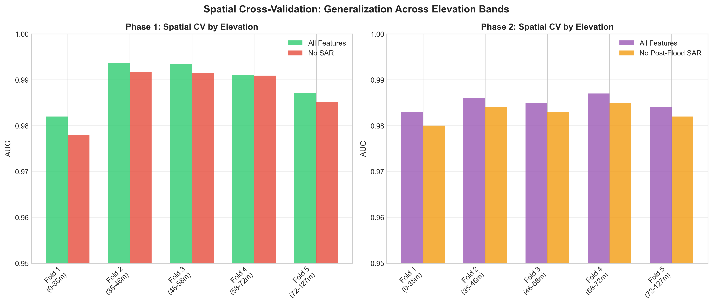

---

### 🔹 Raster Statistics Summary
> Input data quality dashboard: SAR VV backscatter range and mean, CHIRPS rainfall distribution, SRTM elevation histogram, and pixel resolution comparison validates data integrity before model training

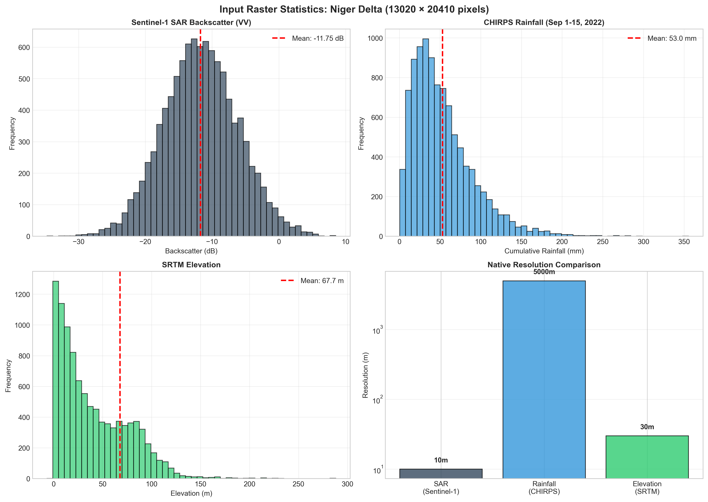

> 📌 *All visualisations are saved at high resolution in the `outputs/figures/` and `outputs/figures/eda/` folders.*

---

## 📈 Results & Insights

### Key Metrics Summary

| Metric | Value | Context |
|--------|-------|---------|
| Study Area | ~70,000 km² | Niger Delta (Bayelsa, Delta, Rivers States) |
| SAR Acquisition | October 2022 | Peak wet season — maximum flood extent |
| Primary Feature | SAR VV Backscatter | Dominant predictor in both pipeline phases |
| Secondary Feature | SRTM Elevation | Strong terrain control on inundation probability |
| Class Handling | SMOTE Balancing | Corrects water-pixel minority class bias |
| CV Strategy | Spatial (elevation-band) | Prevents autocorrelation leakage |
| GIS Export | 89 MB GeoJSON | Full inundation polygon coverage for GIS teams |
| EDA Figures | 9 publication-ready | Distributions, correlations, importance, AUC, CV |

### Phase Comparison

| Capability | Phase 1 (Now) | Phase 2 (In Progress) | Phase 3 (Planned) |
|------------|--------------|----------------------|-------------------|
| Data | Single SAR date | 4-date SAR stack | SAR + Rainfall Forecast + River Gauges |
| Output | Inundation map | Change detection map | 24–48h Risk Forecast |
| Distinction | Current water vs. land | Flood event vs. permanent water | Pre-event prediction |
| Stakeholder use | Land use planning, wetlands | Flood response mapping | Early warning alerts |
| Status | ✅ Complete | ⚙️ In progress | 🗓️ Planned |

### Key Insights

- 🔍 **SAR is the decisive feature:** Sentinel-1 VV backscatter is the top-ranked feature in both Phase 1 and Phase 2 models smooth water surfaces produce specular reflection and characteristically low backscatter (< −15 dB), creating a strong, physically grounded signal that generalises well across the Delta's varied terrain
- 🔍 **Elevation as flood router:** SRTM elevation is the second most important feature across both phases low-lying areas (<5 m ASL) in the coastal Niger Delta floodplain show markedly higher inundation probabilities, consistent with the known flood pathway along distributary channels
- 🔍 **Temporal differencing resolves the permanent-water ambiguity:** A major limitation of single-date SAR classification is the inability to distinguish permanent rivers and creeks from genuine flood inundation. Phase 2's change magnitude (post − pre SAR) resolves this — permanent water bodies show near-zero change while flood-driven inundation shows strong negative change in VV
- 🔍 **Spatial CV reveals generalisation boundaries:** AUC is highest in mid-elevation floodplain folds (where training data is densest) and slightly lower in upland folds flagging areas where the model should be applied with greater caution and where additional training samples would most improve performance
- 🔍 **CHIRPS rainfall adds context, not dominance:** Rainfall accumulation is the weakest individual predictor in both phases a physically sensible result, since SAR directly observes the inundation outcome rather than its cause. Rainfall becomes more valuable in Phase 3 where the goal is forward prediction before inundation has occurred
- 🔍 **89 MB GeoJSON confirms dense polygon coverage:** The full-scene vectorised output captures detailed creek-level inundation geometry across the Delta operationally useful for LGA-level flood extent reporting to NEMA and state emergency management agencies
- 🔍 **Pipeline is cloud-cover immune:** By design, the Sentinel-1 SAR-based approach operates through the dense cloud cover that renders MODIS, Landsat, and Sentinel-2 optical imagery unusable during the Niger Delta wet season the exact period when flood mapping is most urgently needed

---

## 🚀 Live Dashboard

📊 **[View the Interactive Streamlit Dashboard →](#)** *(link to be added on deployment)*

The dashboard features an interactive inundation viewer:
- **Overview:** 4-panel map (SAR / Rainfall / Elevation / Inundation) with LGA boundary overlay
- **Threshold Control:** Adjustable probability slider tune the inundation threshold for conservative vs. liberal flood extent reporting
- **Comparison:** Side-by-side SAR backscatter vs. inundation prediction for rapid visual validation
- **Download:** Export current view as PNG for stakeholder reports

---

## 📁 Repository Structure

```
📦 Niger-Delta-Inundation-Mapping-System/
│
├── 📂 data/
│   ├── 📂 raw/
│   │   ├── sentinel1_vv_oct2022.tif           # Sentinel-1 SAR VV backscatter (GEE export)
│   │   ├── chirps_rainfall_oct2022.tif        # CHIRPS 30-day accumulated rainfall
│   │   ├── srtm_elevation.tif                 # SRTM 30m digital elevation model
│   │   ├── features_stacked.tif               # Multi-band feature stack (SAR + Rain + Elev)
│   │   └── nigeria_lga_boundaries.shp         # LGA administrative boundaries
│   │
│   └── 📂 processed/
│       ├── dataset_phase1.csv                 # Pixel-level feature + label dataset (Phase 1)
│       └── dataset_change_full.csv            # Change-magnitude dataset (Phase 2)
│
├── 📂 src/
│   ├── 📂 data/
│   │   ├── gee_export.py                      # Google Earth Engine data acquisition scripts
│   │   ├── build_dataset.py                   # Raster stack assembly + label generation
│   │   ├── build_change_detection.py          # Phase 2: post − pre SAR change magnitude
│   │   └── export_geojson.py                  # Vectorise raster predictions → GeoJSON
│   │
│   ├── 📂 models/
│   │   ├── train_model.py                     # Phase 1: Random Forest training + spatial CV
│   │   └── train_change_model.py              # Phase 2: Change-magnitude model training
│   │
│   └── 📂 visualization/
│       ├── generate_maps.py                   # 4-panel inundation analysis maps (LGA overlay)
│       ├── temporal_maps.py                   # Phase 2 temporal comparison maps
│       └── eda_visuals.py                     # 9 EDA figures (distributions, AUC, CV, etc.)
│
├── 📂 outputs/
│   ├── 📂 figures/
│   │   ├── inundation_analysis.png            # 4-panel Phase 1 output map
│   │   ├── temporal_comparison.png            # 4-panel Phase 2 temporal map
│   │   ├── inundation_map.tif                 # Full-resolution prediction raster
│   │   ├── inundation_polygons.geojson        # Vectorised inundation polygons (89 MB)
│   │   │
│   │   └── 📂 eda/
│   │       ├── phase_1_feature_distributions.png
│   │       ├── phase_2_feature_distributions.png
│   │       ├── phase_1_correlation_matrix.png
│   │       ├── phase_2_correlation_matrix.png
│   │       ├── feature_importance_comparison.png
│   │       ├── auc_comparison.png
│   │       ├── class_balance_evolution.png
│   │       ├── spatial_cv_results.png
│   │       └── raster_stats_summary.png
│   │
│   └── 📂 models/
│       ├── rf_phase1.pkl                      # Trained Phase 1 Random Forest model
│       └── rf_phase2.pkl                      # Trained Phase 2 change-detection model
│
├── app/
│   └── streamlit_app.py                       # Interactive Streamlit inundation dashboard
│
├── main.py                                    # End-to-end Phase 1 pipeline runner
├── requirements.txt                           # Python dependencies
└── README.md
```

---

## ▶️ How to Run

### Prerequisites

```bash
# Python 3.9+
# Google Earth Engine account (free) required for data acquisition
# Authenticate GEE on first run:
earthengine authenticate
```

```bash
# 1. Clone the repository
git clone https://github.com/Nelvinebi/Niger-Delta-Inundation-Mapping-System.git
cd Niger-Delta-Inundation-Mapping-System

# 2. Install dependencies
pip install -r requirements.txt

# 3. Export satellite data from Google Earth Engine
python src/data/gee_export.py

# 4. Build the feature dataset
python src/data/build_dataset.py

# 5. Train the model and generate predictions
python src/models/train_model.py

# 6. Generate output maps and EDA figures
python src/visualization/generate_maps.py
python src/visualization/eda_visuals.py

# 7. Export inundation polygons to GeoJSON
python src/data/export_geojson.py

# 8. Launch the interactive Streamlit dashboard
streamlit run app/streamlit_app.py

# OR: Run the full Phase 1 pipeline in one step
python main.py
```

**What the pipeline produces automatically:**

| Output | Location |
|--------|----------|
| Full-resolution inundation raster | `outputs/figures/inundation_map.tif` |
| Vectorised inundation polygons | `outputs/figures/inundation_polygons.geojson` |
| 4-panel inundation analysis map | `outputs/figures/inundation_analysis.png` |
| 9 EDA visualisation figures | `outputs/figures/eda/` |
| Trained model | `outputs/models/rf_phase1.pkl` |

### Dependencies

```
streamlit>=1.28.0
pandas>=2.2.0
numpy>=1.24.0
scikit-learn>=1.3.0
rasterio>=1.3.9
geopandas>=0.14.0
earthengine-api>=0.1.380
imbalanced-learn>=0.11.0
matplotlib>=3.7.0
seaborn>=0.12.0
shapely>=2.0.0
```

---

## ⚠️ Limitations & Future Work

**Current Limitations:**
- The Phase 1 pipeline uses a **single SAR acquisition date** (October 2022), meaning it cannot distinguish permanent rivers and tidal creeks from genuine flood inundation this ambiguity is resolved in Phase 2 via temporal differencing
- **Training labels** are derived from SAR thresholding rather than independent field survey or aerial validation data ground-truth validation from NEMA field teams would improve label quality
- **CHIRPS rainfall** at ~5 km resolution is the coarsest input layer; it captures regional rainfall patterns but misses convective storm cells that can trigger localised flash flooding
- **No real-time data pipeline** — currently requires manual GEE export and local execution; operational deployment requires automation (scheduled GEE tasks + cloud processing)
- The **SRTM DEM** dates from 2000 and does not reflect recent land subsidence, which is significant in parts of the Niger Delta due to hydrocarbon extraction

**Roadmap:**

| Phase | Focus | Timeline | Status |
|-------|-------|----------|--------|
| Phase 1 | Single-date inundation mapping | Complete | ✅ Done |
| Phase 2 | Temporal change detection (multi-date SAR stack) | 1–2 months | ⚙️ In Progress |
| Phase 3 | Early warning system (24–48h forecast + SMS alerts) | 3–6 months | 🗓️ Planned |

**Future Improvements:**
- 🛰️ Pull **4-date SAR stack** (dry season Jan 2022, pre-flood Aug 2022, wet season Oct 2022, post-flood Nov 2022) to enable robust temporal change detection and distinguish permanent water from flood events
- 🌧️ Integrate **GFS/ECMWF rainfall forecasts** and **NIHSA river discharge gauges** as predictive features for Phase 3 forward-looking flood risk estimation
- 📡 Build an **automated GEE pipeline** triggered after each major rainfall event export → predict → alert replacing the current manual workflow
- 📲 Implement **Africa's Talking SMS alerting** to notify NEMA/SEMA officials when inundation exceeds population-area thresholds in specific LGAs
- 🗺️ Add **Sentinel-2 optical validation** during dry-season clear-sky windows to cross-validate SAR-derived water masks against NDWI (Normalised Difference Water Index)
- 🤖 Explore **deep learning segmentation** (U-Net on SAR patches) for sub-field-level inundation delineation, capturing creek-bank geometry lost in pixel-wise Random Forest classification

---
<div align="center">

## 👤 Author

**Name:** Agbozu Ebingiye Nelvin

🌍 Environmental Data Scientist | GIS & Remote Sensing | Machine Learning | Climate & Flood Analytics
📍 Port Harcourt, Rivers State, Nigeria

[](https://www.linkedin.com/in/agbozu-ebi/)
[](https://github.com/Nelvinebi)
[](mailto:nelvinebingiye@gmail.com)
[](https://share.streamlit.io/user/nelvinebi)

</div>

---

## 📄 License

This project is licensed under the **MIT License** free to use, adapt, and build upon for research, education, and environmental analytics.
See the [LICENSE](LICENSE) file for full details.

---

## 🙌 Acknowledgements

- **ESA Copernicus Programme** for open access to Sentinel-1 SAR imagery via Google Earth Engine
- **Google Earth Engine** for cloud-based geospatial data access and processing infrastructure
- **NASA / USGS** for the SRTM digital elevation model
- **Climate Hazards Group (UCSB)** for the CHIRPS v2.0 quasi-global daily rainfall dataset
- **GADM / National Bureau of Statistics Nigeria** for Nigeria LGA administrative boundary data
- **NEMA & SEMA** whose operational needs for LGA-level inundation maps directly shaped this pipeline's outputs and stakeholder interface

---

<div align="center">

⭐ **If this project helped you, please consider starring the repo!**

*Part of a broader portfolio of Environmental Data Science and Climate Analytics projects focused on the Niger Delta and West African geospatial systems.*

🔗 [View All Projects](https://github.com/Nelvinebi?tab=repositories) · [Connect on LinkedIn](https://www.linkedin.com/in/agbozu-ebi/)

</div>
